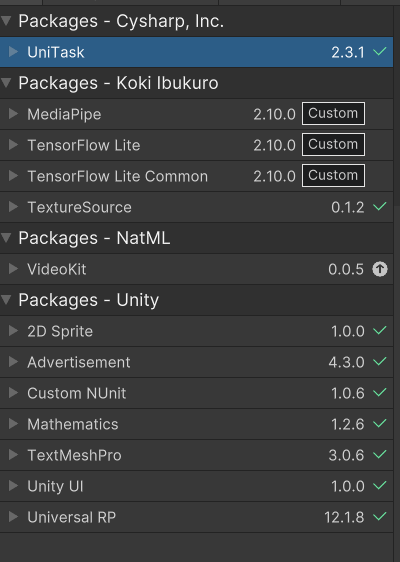

# Game FaceDance

## Requirements

**Packages**


### _VideoKit_

- Record, capture scenes and save it in internal file

### Installing VideoKit

Add the following items to your Unity project's `Packages/manifest.json`:

```json
{
  "scopedRegistries": [
    {
      "name": "NatML",
      "url": "https://registry.npmjs.com",
      "scopes": ["ai.natml"]
    }
  ],
  "dependencies": {
    "ai.natml.videokit": "0.0.9"
  }
}
```

### Example Recording video

Step 1: create a `VideoKitRecorder` component
Step 2: call in scripts

```
using NatML.VideoKit;

(VideoRecorder) recorder.StartRecording(); // call to record video
(VideoRecorder) recorder.Stop(); // call to stop recording video
```

### Example Streaming camera

Step 1: create a `VideoKitCameraManager` component
Step 2: create a UI raw image and attach a `VideoKitCameraView`

### _TensorFlow Lite_

### Example to detect face mask

```
using TensorFlowLite;

(FaceMesh.Result) face.keypoints[index];
```

### _Rhythm Tool_

- Requirement: add `AudioImporter` on Assets Store

```markdown
AudioImporter enables you to import audio files at runtime in Unity. It loads an audio file into an AudioClip. The package includes a simple file browser that can be used to select a file.
```

```markdown
RhythmTool is a straightforward scripting package for Unity, with all the basic functionality for creating games that react to music.

RhythmTool can analyze an entire song before playing it, or while it’s being played.

There are a number of types of data it provides:
• Beats
• Onsets
• Pitch
• Changes in overall intensity
• Volume
```

### RhythmData

- RhythmData has the following structure. A RhythmData can have several Tracks, each of which contains a collection of a specific type of Feature. Feature is the base type of information in a song. Each Feature has a timestamp and a length.

```
using UnityEngine;

public class AnalyzeExample : MonoBehaviour
{
    public RhythmAnalyzer analyzer;

    public AudioClip audioClip;

    public RhythmData rhythmData;

    void Start ()
    {
        //Start analyzing a song.
        rhythmData = analyzer.Analyze(audioClip);

        //Find a track with Beats.
        Track<Beat> track = rhythmData.GetTrack<Beat>();
    }
}
```

### Importing a Song

```
using UnityEngine;
using RhythmTool;

public class ImporterExample : MonoBehaviour
{
    public string path;
    public AudioImporter importer;
    public RhythmAnalyzer analyzer;

    void Awake()
    {
        importer.Loaded += OnLoaded;
        importer.Import(path);
    }

    private void OnLoaded(AudioClip clip)
    {
        analyzer.Analyze(clip);
    }
}
```

- In this project, we can use `RhythmPlayer` to interact with `AudioClip` such as Play, Stop or Pause, .e.t.c
-

## Description
### Entites

- FaceNote
  - Generate follow to music beat by using RhythmData to get Onset list, sponse it on timestamp.
  - Using `Pooling Object` contain a number of pre-initialized `FaceNote`. When we need a FaceNote we just take in the pool and `setActive(true)` it, then after using it, we `setActive(false)` it.
  - Position calculate by position of left-top and right-bottom
  - FaceNote move from bot to top, init 0 velocity, update `fowardForce*1/50` per frame, speed change by `fowardForce`
  - Movement of `FaceNote` is `FaceNoteMovement` script.

- Player
  - A list to contain all `FaceNote`.
  - Per Frame we find in list a `FaceNote` match with `FaceResult` and remove it out of list.
  - Container of list is `FacePlayerMovement`.

- FaceGameController 
  - Take player's face then detect by FaceMeshProcessor to get `FaceMesh.Result`.
  - `FaceMesh.Result` has 468 points.
  - Check player's face is match with `FaceNote` or not and update score.
  - Scores are changed by position of `MatchZone`

- FaceGenerate
  - Contain the `PoolFaceNote`
  - Initialize pool when game play start
  - Random position `FaceNote`
  - Method `Respawn()` to generate `FaceNote`

- AnalyzingMusic
  - Loading a song then analysis `RhythmData`.
  - Play song in timestamp of first onset

- SongController
  - Contain name, author, path, time of song
  - Method to parse name, author

- DataSO
  - Object to save data to using in different scenes.

- ListMusicController
  - Display list of song on screen.

- StartPlayerController
  - Check player show face in center

- VideoRecorder
  - Provide methods to record scene.
# TensorFlow Lite for Unity Samples

[](https://www.npmjs.com/package/com.github.asus4.tflite)

Porting of ["TensorFlow Lite Examples"](https://www.tensorflow.org/lite/examples) and some utilities for Unity.

Tested on

- iOS / Android / macOS / Windows / Linux
- Unity 2020.3.29f1
- TensorFlow 2.9.1

Included examples:

- TensorFlow
  - MNIST
  - SSD Object Detection
  - DeepLab
  - PoseNet
  - Style Transfer
  - Text Classification
  - Bert Question and Answer
  - Super Resolution
- MediaPipe
  - Hand Tracking
  - Blaze Face
  - Face Mesh
  - Blaze Pose (Full body)
  - Selfie Segmentation

Included prebuilt libraries:

|                | iOS | Android | macOS |     Ubuntu      | Windows |
| -------------- | :-: | :-----: | :---: | :-------------: | :-----: |
| Core CPU       | ✅  |   ✅    |  ✅   |       ✅        |   ✅    |
| Metal Delegate | ✅  |    -    |  ✅   |        -        |    -    |
| GPU Delegate   |  -  |   ✅    |   -   | ✅ Experimental |    -    |
| NNAPI Delegate |  -  |   ✅    |   -   |        -        |    -    |

- You need to install OpenGL ES and OpenCL to run GPU Delegate on Linux. See [MediaPipe](https://google.github.io/mediapipe/getting_started/gpu_support.html#opengl-es-setup-on-linux-desktop) for details.

## Install TensorFlow Lite for Unity

- If you want to try all examples, clone this repository with [Git-LFS](https://git-lfs.github.com/).
- If you just need TensorFlow Lite libraries via UPM, open the file `Packages/manifest.json` and add following lines into `scopedRegistries` and `dependencies` section.

```json
{
  "scopedRegistries": [
    {
      "name": "package.openupm.com",
      "url": "https://package.openupm.com",
      "scopes": [
        "com.cysharp.unitask"
      ]
    },
    {
      "name": "npm",
      "url": "https://registry.npmjs.com",
      "scopes": [
        "com.github.asus4"
      ]
    }
  ],
  "dependencies": {
    // Core TensorFlow Lite libraries
    "com.github.asus4.tflite": "2.10.0",
    // Utilities for TFLite
    "com.github.asus4.tflite.common": "2.10.0",
    // Utilities for MediaPipe
    "com.github.asus4.mediapipe": "2.10.0",
    ...// other dependencies
  }
}
```

## Build TensorFlow Lite libraries

Pre-built libraries are included. If you want to build the latest TFLite,

1. Clone [TensorFlow library](https://github.com/tensorflow/tensorflow/)
2. Run `./configure` in the TensorFlow library
3. Run `./build_tflite.py` (Python3) to build for each platform

```sh
# Update iOS, Android and macOS
./build_tflite.py --tfpath ../tensorflow -ios -android -macos

# Build with XNNPACK
./build_tflite.py --tfpath ../tensorflow -macos -xnnpack
```

## TIPS

\[Android\] You can see logs from tflite by filtering with "tflite"

```bash
# Filtering logcat only Unity and tflite
adb logcat Unity:V tflite:V "*:S"
```

## Show Cases

**MNIST**  


**SSD Object Detection**  


**DeepLab Semantic Segmentation**  


**Style Transfer**  


**Hand Tracking**  


**BERT**  


## License

Samples folder `Assets/Samples/*` is licensed under MIT

```markdown
MIT License

Copyright (c) 2021 Koki Ibukuro

Permission is hereby granted, free of charge, to any person obtaining a copy
of this software and associated documentation files (the "Software"), to deal
in the Software without restriction, including without limitation the rights
to use, copy, modify, merge, publish, distribute, sublicense, and/or sell
copies of the Software, and to permit persons to whom the Software is
furnished to do so, subject to the following conditions:

The above copyright notice and this permission notice shall be included in all
copies or substantial portions of the Software.

THE SOFTWARE IS PROVIDED "AS IS", WITHOUT WARRANTY OF ANY KIND, EXPRESS OR
IMPLIED, INCLUDING BUT NOT LIMITED TO THE WARRANTIES OF MERCHANTABILITY,
FITNESS FOR A PARTICULAR PURPOSE AND NONINFRINGEMENT. IN NO EVENT SHALL THE
AUTHORS OR COPYRIGHT HOLDERS BE LIABLE FOR ANY CLAIM, DAMAGES OR OTHER
LIABILITY, WHETHER IN AN ACTION OF CONTRACT, TORT OR OTHERWISE, ARISING FROM,
OUT OF OR IN CONNECTION WITH THE SOFTWARE OR THE USE OR OTHER DEALINGS IN THE
SOFTWARE.
```

Other Licenses

- [TensorFlow](https://github.com/tensorflow/tensorflow/blob/master/LICENSE): Apache License 2.0
- [MediaPipe](https://github.com/google/mediapipe/blob/master/LICENSE): Apache License 2.0
  - Some MediaPipe C# codes are based on [terryky/tflite_gles_app](https://github.com/terryky/tflite_gles_app)

Model Licenses

📌 : Each TensorFlow Lite model might have a different license. Please check the license of the model you use.

- [Official TFlite Models](https://www.tensorflow.org/lite/examples)
  - Bert
  - SSD
  - DeepLab Lab
  - MNIST
  - Style Transfer
  - PoseNet
  - Text classification
  - Smart Reply
- [MediaPipe Models](https://github.com/google/mediapipe)
  - Blaze Pose
  - Face Mesh
  - Hand Tracking
  - Selfie Segmentation
    - Using the modified model from [PINTO_model_zoo](https://github.com/PINTO0309/PINTO_model_zoo) to remove the custom post-process.
